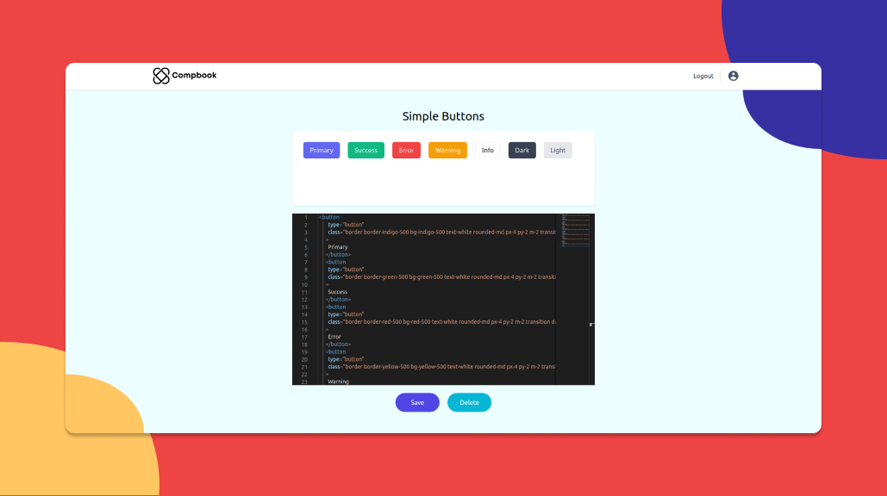

# Compbook

Tailwind components get you up and running in no time. The problem is that they are hard to manage, so I built compbook. Compbook allow you to organize your component library, create templates and use them ease!

Check out the live demo: https://compbook.netlify.app/

This app is build using React, Tailwind, and Firebase

## How to run the project?

1. Clone this repository in your local system.
2. Rename `.env.example` to `.env_local` and add your firebase credentials.
3. Open the command prompt from your project directory and run the command `npm install && npm start`.
4. Go to your browser and type `http://localhost:3000/` in the address bar.
5. Hurray! That's it.
